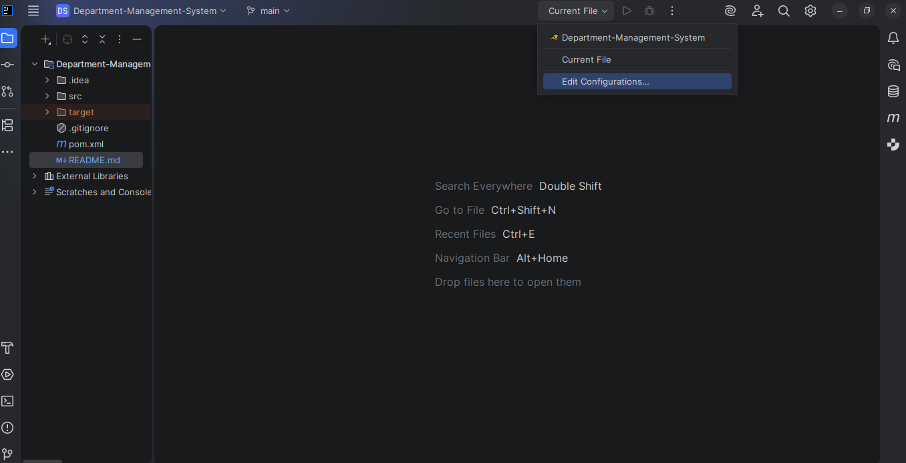
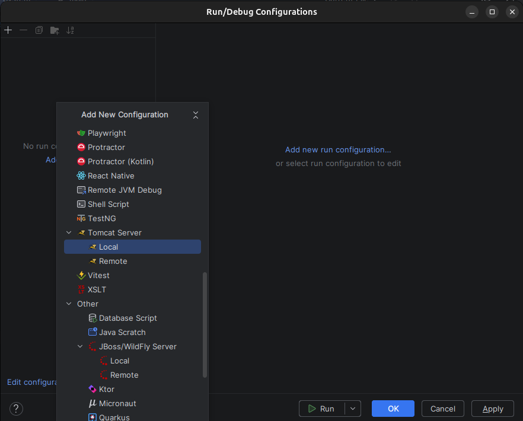
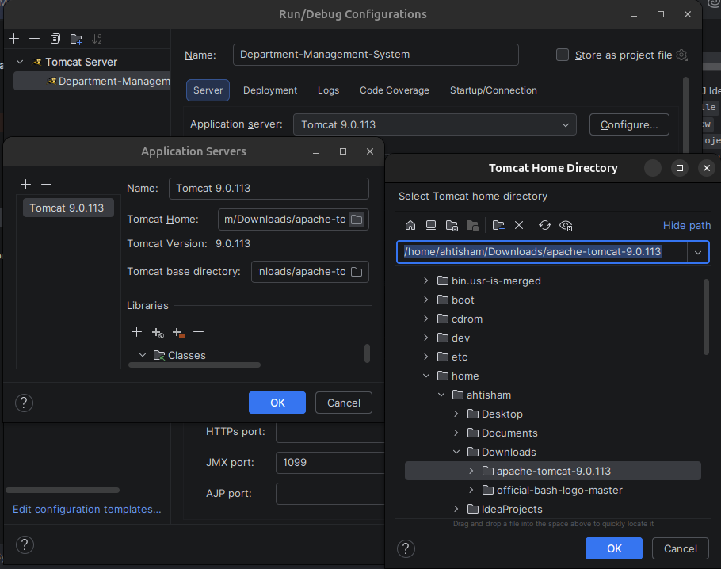
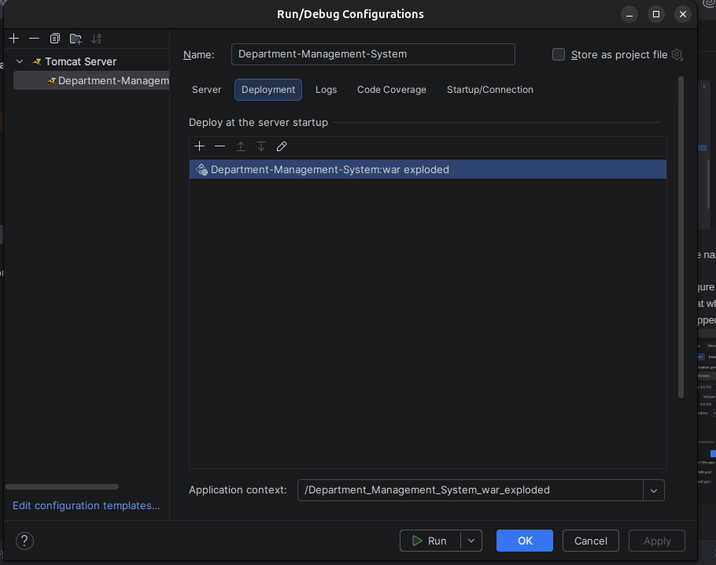

# Department-Management-System
## Setup and Configuration
You'll Need 
- Java Development Kit (JDK)
- IntelliJ Idea `You can use any Code Editor`
- Apache Tomcat Server [Apache Tomcat](https://tomcat.apache.org/download-90.cgi) for Linux download tar.gz

We have used Apache Tomcat 9, you can use 9 or newer version.
Download the Apache Tomcat Server and unzip/extract folder of the Apache Tomcat.

Clone the Repository
```
https://github.com/Haziq8900/Department-Management-System.git
```

For Linux
```
git@github.com:Haziq8900/Department-Management-System.git
```

- Open IntelliJ Idea
- Click on `File` tab
- Click on `New`
- Click on `Project from Version Control`
- Paste the Repo URL

Click on Edit Configuration

Select Tomcat Server `Local`

- Give a suitable name to the server according to the project
- Click on configure and select the folder of Apache Tomcat which you've extracted/unzipped.


- Now go to Deploment Tab
- Click on add Icon `+`
- Select War:Exploded
- `Apply` and `Ok`


You'll see the Run option, and your Apache Tomcat server is ready to run the application


For any help open `Issue`

# Database Schema

```sql
CREATE TABLE IF NOT EXISTS teachers (
                                        id INT AUTO_INCREMENT PRIMARY KEY,
                                        name VARCHAR(200) NOT NULL,
                                        email VARCHAR(200) NOT NULL UNIQUE,
                                        department VARCHAR(200),
                                        phone VARCHAR(50)
);
```

```sql
CREATE TABLE IF NOT EXISTS students (
                                        id INT AUTO_INCREMENT PRIMARY KEY,
                                        name VARCHAR(200) NOT NULL,
                                        email VARCHAR(200) NOT NULL UNIQUE,
                                        enrollment_number VARCHAR(100) NOT NULL UNIQUE,
                                        department VARCHAR(200),
                                        semester INT
);

```
```sql
CREATE TABLE IF NOT EXISTS courses (
                                       id INT AUTO_INCREMENT PRIMARY KEY,
                                       code VARCHAR(100) NOT NULL UNIQUE,
                                       title VARCHAR(255) NOT NULL,
                                       credits INT,
                                       teacher_id INT,
                                       CONSTRAINT fk_course_teacher FOREIGN KEY (teacher_id) REFERENCES teachers(id) ON DELETE SET NULL
);
```

```sql
CREATE TABLE IF NOT EXISTS users (
                                     id INT AUTO_INCREMENT PRIMARY KEY,
                                     username VARCHAR(50) UNIQUE NOT NULL,
                                     password VARCHAR(255) NOT NULL,
                                     email VARCHAR(100) UNIQUE NOT NULL,
                                     role ENUM('Admin', 'Teacher', 'Student') DEFAULT 'Student',
                                     created_at TIMESTAMP DEFAULT CURRENT_TIMESTAMP
)
```

```sql
CREATE TABLE IF NOT EXISTS result (
                                      teacher_name VARCHAR (100) NOT NULL,
                                      course_title VARCHAR (255) NOT NULL UNIQUE,
                                      course_code VARCHAR (100),
                                      student_enrollment_no VARCHAR (100),
                                      sessional_marks INT,
                                      mid_marks INT,
                                      final_marks INT
)
```
